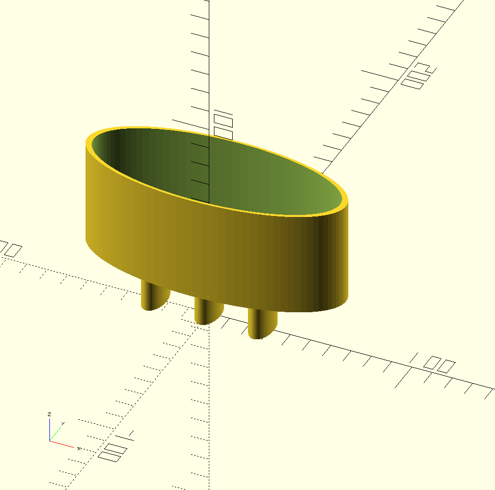

# Bathroom Soap Dispenser Holder

There is an old toothbrush holder built directly into the wall in my apartment bathroom; unfortunately the holes are not big enough to toothbrushes of the 21st century. Instead I have used it as a small shelf to hold hand soap.

However, I knock the soap off _all the time_.

This model is fit to use the holes in the existing infrastructure and to provide an improved way to hold the soap dispenser.

---

